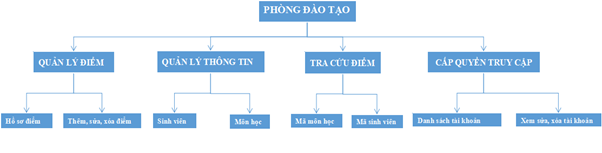
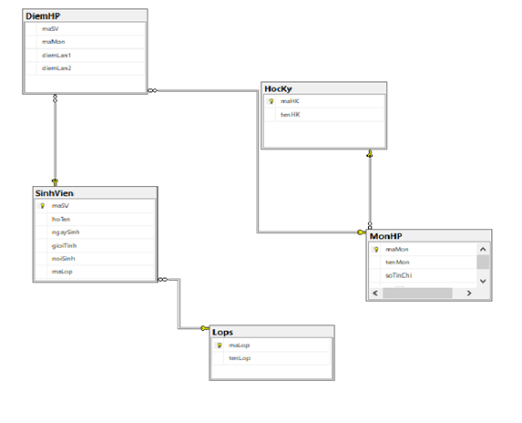
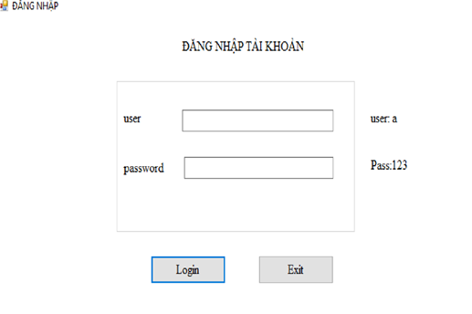
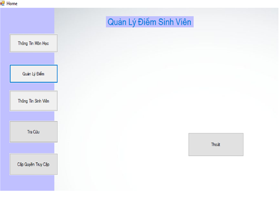
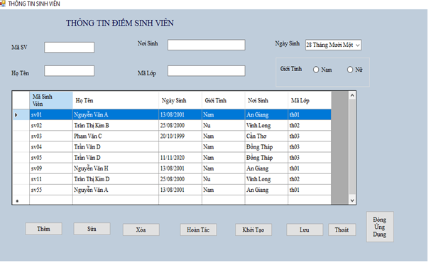
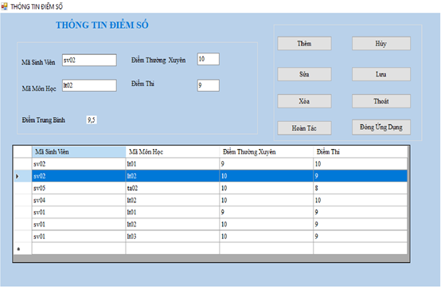
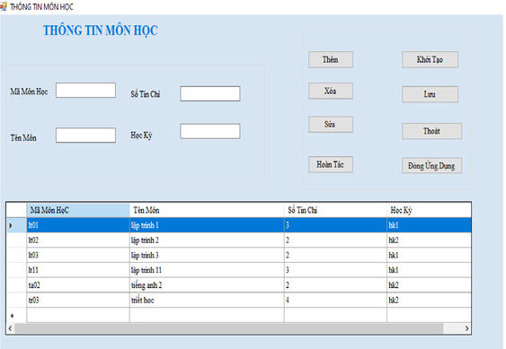

# [C#] WINDOWS APP QUẢN LÝ ĐIỂM SINH HỌC SINH/ SINH VIÊN
## Introduction
Trong giáo dục và đào tạo, công tác quản lý điểm sinh viên trong quá trình học tập là rất phức tạp và đòi hỏi độ chính xác cao. Đảm bảo khi mỗi sinh viên tốt nghiệp cũng như sinh viên đang học tập thì điểm học tập các môn học phản ánh cả một quá trình phấn đấu rèn luyện. Trong suốt quá trình học tập điểm học tập của các môn học và điểm thi tốt nghiệp là cơ sở để xếp loại đánh giá chất lượng sinh viên. Do đó công tác quản lý điểm sinh viên đòi hỏi phải có sự thống nhất và tuyệt đối chính xác giúp cho các cơ quan quản lý có điều chỉnh hợp lý, kịp thời về phương pháp quản lý và kế hoạch đào tạo. 
Hệ thống quản lý điểm sinh viên này sẽ giúp công tác quản lý điểm sinh viên giải quyết được những khó khăn nêu trên và tăng tính hiệu quả của công tác quản lý hệ thống.

Here is my C# source code for WINDOWS FORM APP. With my code: 

##

   
  <i>Sơ đồ phân rã chức năng</i>

   
  <i> Diagram</i>

## Giao Diện Người Dùng
output:

## Giao Diện Người Dùng

   
  <i>Login</i>

   
  <i>Home</i>

   
  <i>Thông tin sinh viên</i>

   
  <i>Quản lý điểm sinh viên</i>

   
  <i>Tra cứu điểm</i>

   
  <i>Quản lý thông tin môn học</i>

   
  <i>Quản lý tài khoản người dùng</i>

## Technology used
* **C# **
* **Window Form**
* **SQL Server** 
*****

